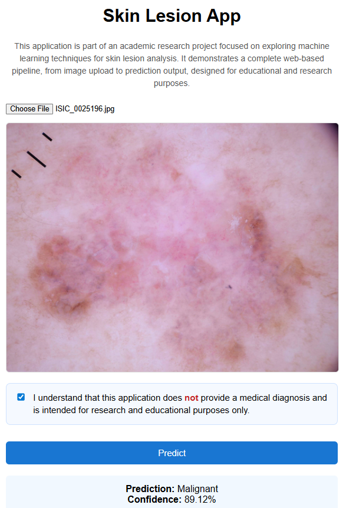
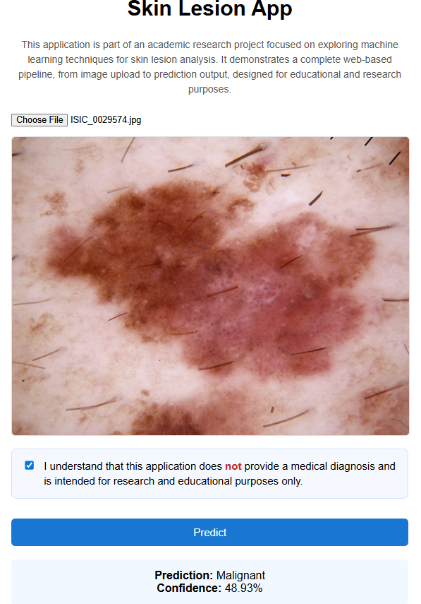
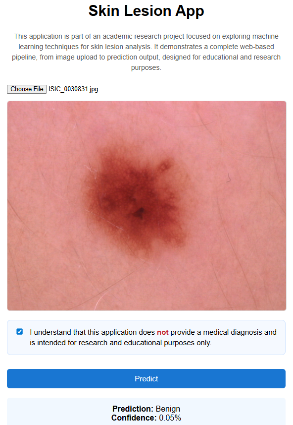

# Deep Learning Skin Cancer Detection
### EfficientNet-B4 Based Binary Classification with Web Deployment

---

## 📌 Project Overview

This project presents a complete end-to-end deep learning pipeline for **binary skin lesion classification (Benign vs Malignant)** using dermoscopic images from the **HAM10000 dataset**.

The system includes:

- Exploratory Data Analysis (EDA)
- Preprocessing & Data Augmentation
- Class Imbalance Handling
- Transfer Learning with EfficientNet-B4
- Two-stage Fine-Tuning Strategy
- Threshold Optimization (Clinical Priority)
- Comprehensive Model Evaluation
- Full-Stack Web Deployment (Node.js + Python inference)

⚠️ **Disclaimer:**  
This system is developed for research and educational purposes only.  
It does NOT provide medical diagnosis.

---

# 🧠 Model Architecture

### Backbone
EfficientNet-B4 (ImageNet pretrained)

### Input Size
224 × 224 RGB images

### Classification Head
- Global Average Pooling
- Dense (256 units, L2 regularization)
- Dropout (0.5)
- Dense (1 unit, Sigmoid activation)

Total Parameters: ~18M  
Trainable Parameters (Stage 1): ~459K  

---

# 📊 Dataset

**Dataset:** HAM10000  
**Task:** Binary classification (Benign vs Malignant)  

### Data Split (Stratified)

| Split        | Size |
|-------------|------|
| Training     | 7010 |
| Validation   | 1502 |
| Test         | 1503 |

### Class Imbalance

- Benign: ~80%
- Malignant: ~20%

To mitigate imbalance, inverse-frequency class weights were applied during training.

---

# ⚙️ Training Strategy

## Stage 1 – Frozen Backbone
- EfficientNet backbone frozen
- Train classifier head only
- Learning rate: 1e-4
- Early stopping on validation AUC

## Stage 2 – Fine Tuning
- Last 20 layers unfrozen
- Learning rate: 1e-5
- ReduceLROnPlateau
- Early stopping

---

# 📈 Test Set Performance (Default Threshold = 0.5)

- **AUC:** 0.89
- **Accuracy:** 0.81

### Classification Report

| Class      | Precision | Recall  | F1-score |
|-----------|-----------|--------|----------|
| Benign     | 0.94      | 0.82   | 0.87     |
| Malignant  | 0.51      | 0.78   | 0.61     |

### Confusion Matrix
[[987 223]
[ 64 229]]

---

# 🎯 Threshold Optimization (Clinical Recall Priority)

To reduce false negatives (missed malignant cases), threshold tuning was performed.

### Optimized Threshold: 0.3087

### Test Performance (Optimized)

- **Malignant Recall:** 0.884
- Precision: 0.440
- Specificity: 0.728
- Accuracy: 0.758

### Confusion Matrix
[[881 329]
[ 34 259]]

This configuration prioritizes malignant detection at the cost of increased false positives, which is clinically safer.

---

# 🌐 Web Application Deployment

The trained EfficientNet-B4 model is deployed in a full-stack web application.

## Architecture
Browser
↓
Node.js (Express Server)
↓
Python Inference Script
↓
TensorFlow Model (.keras)
↓
JSON Response

### Backend
- Node.js (Express)
- Multer (image upload handling)
- SQLite (authentication)
- Session management
- Child process execution for Python inference

### ML Integration
Node.js invokes a Python script which:
- Loads the trained `.keras` model
- Preprocesses the input image
- Returns prediction probabilities

---

### Malignant Prediction (High Confidence)

Prediction: Malignant  
Confidence: 89.12%

---

### Malignant Prediction (Moderate Confidence)

Prediction: Malignant  
Confidence: 48.93%

---

### Benign Prediction Example

Prediction: Benign  
Confidence: 0.05%

---

The trained model is stored using **Git LFS**.

---

# 🚀 How to Run the Web Application

### 1️⃣ Clone Repository

git clone https://github.com/hanabejaoui/Deep-Learning-Skin-Cancer-Detection.git

cd Deep-Learning-Skin-Cancer-Detection/web-app

### 2️⃣ Install Node.js Dependencies
npm install 

### 3️⃣ Create Python Virtual Environment (Recommended)
python -m venv venv
venv\Scripts\activate # Windows

### 4️⃣ Install Python Dependencies
pip install -r ML/requirements.txt

### 5️⃣ Run Server
node server.js

### 6️⃣ Open in Browser
http://localhost:3000

---

# 💻 Training Environment

- Python 3.10
- TensorFlow 2.19
- NVIDIA Tesla T4 GPU
- Google Colab
- Node.js + Express

---

# 📚 Academic Context

This project was developed as part of a Master’s thesis focused on:

**Development of a Web-Based Application for Skin Cancer Detection Using Deep Learning**

---

# 👤 Author

Hana Bejaoui  
Master’s in Computer Science  
Széchenyi István University

---
