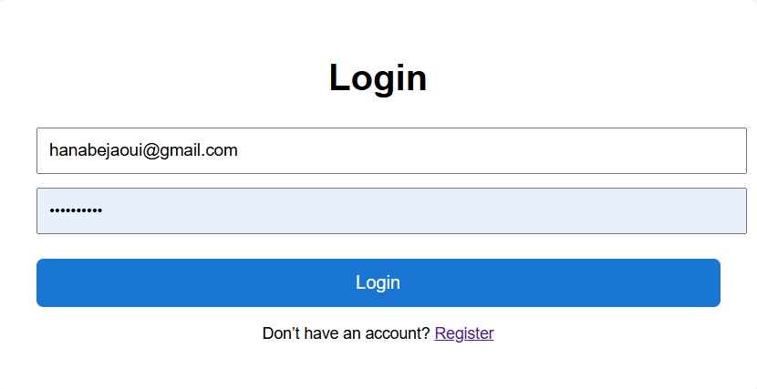
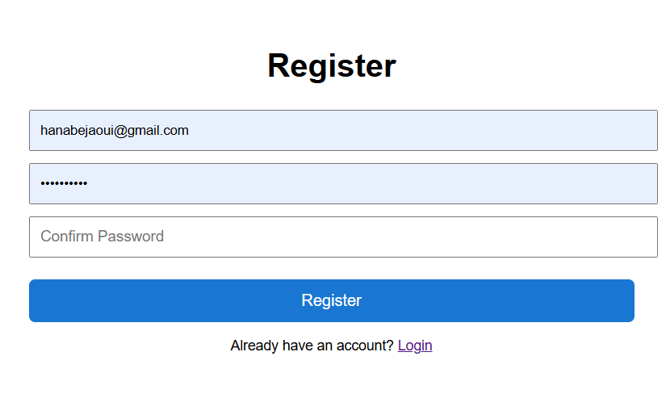

# Web Application – Skin Lesion Classification (Benign vs Malignant)

This folder contains the **Node.js (Express)** web application used to deploy the skin lesion classifier developed in this thesis project.  
The application provides a simple workflow: **Register → Login → Upload Image → Predict**.

⚠️ **Disclaimer:** This application is for **research and educational purposes only** and does **not** provide medical diagnosis.

---

## Features

- User authentication (**Register / Login**) with SQLite storage
- Protected prediction page (only accessible after login)
- Image upload interface
- Disclaimer confirmation before prediction
- Displays the final prediction output (Benign / Malignant)

---

## User Interface

### 1) Login Page
Users log in using their email and password.

**Figure 1. Login page**


---

### 2) Registration Page
New users create an account by providing email and password (with confirmation).

**Figure 2. Registration page**


---

### 3) Prediction Page
Authenticated users can upload an image, accept the disclaimer, and request a prediction.

**Figure 3. Prediction interface**


---

## Project Structure


web-app/
├── db/ # SQLite database logic / connection
├── public/ # Static frontend files
│ ├── index.html
│ ├── login.html
│ ├── register.html
│ ├── style.css
│ └── app.js
├── images/ # README screenshots (login/register/prediction)
│ ├── login.png
│ ├── register.png
│ └── prediction.png
├── server.js # Express backend server
├── package.json
├── package-lock.json
└── .gitignore


---

## System Flow (High-level)

1. User registers and credentials are stored in SQLite.
2. User logs in and a session is created.
3. Authenticated user uploads an image.
4. Backend processes the request and returns the prediction.
5. UI displays the output (Benign / Malignant).

---

## Run Locally

### 1) Go to the web app folder
```bash
cd web-app
2) Install dependencies
npm install
3) Start the server
node server.js
4) Open in browser
http://localhost:3000